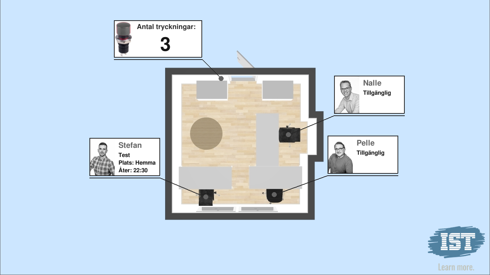

# OfficeControl
A script for controlling the actions to be preformed when the button at our door is pressed. Keeps track of all office menbers calendars by parsing an ical url.



## Hardware and setup
The script is intended to run on a Raspberry PI, the button have to be connected to GIPO pin (BCM) as specified in the config.yaml

### Config
Copy the config.yaml.template to config.yaml. Update the appropriate values. Images should be put in the asstes directory.
```yaml
gpio:
  pin: 24 # the Bcm pin to connect the button to
ical:
  - name: # A name for the user a calender belongs to
    url: # An http(s) url to an ical calendar
    pos_x: 537 # X coordinate for where the office worker is localed
    pos_y: 516 # Y coordinate for where the office worker is localed
    offset: -120 # Offset the info box this many pixels
    image: stefan.jpg # Image of the office worker
  - name: ..
    url: ..
sound:
  freq: 24000     # audio CD quality
  bitsize: -16    # unsigned 16 bit
  channels: 1     # 1 is mono, 2 is stereo
display:
  width: 1280
  height: 720
  fullscreen: true
  background: room_720p.png
  ```

IF NOT ON Raspberry Pi you will need to comment out GPIO:
```yaml
#gpio:
#  pin: 24 # the Bcm pin to connect the button to
```

## Dependencies
Tested with Python 3.6.

Install all the requirements with the command:
`pip install  -r requirements.txt`


## Executing
Start the system by running: `python door_button.py`
